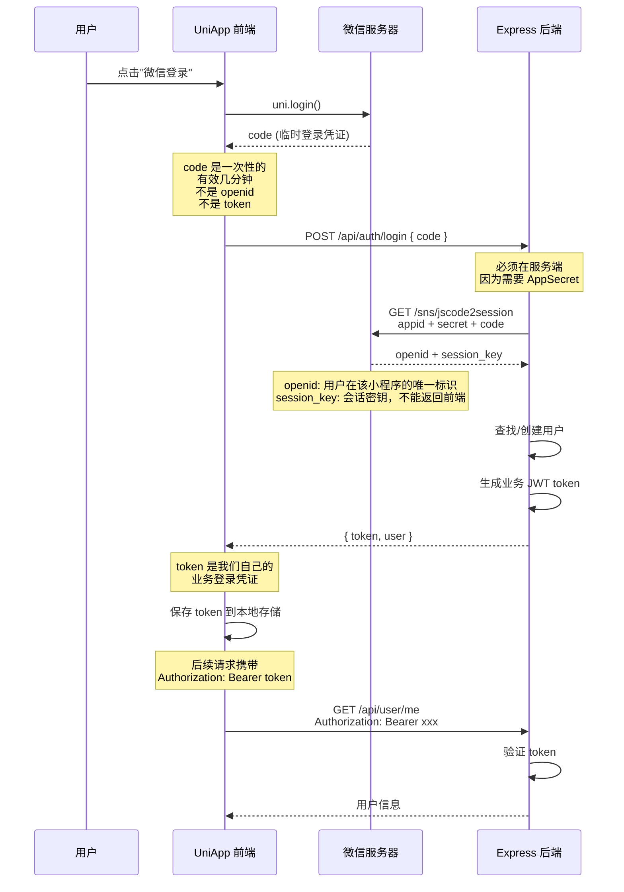
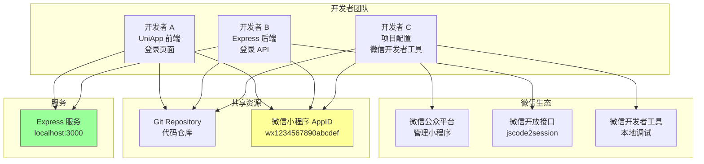

# UniApp 微信小程序多人协作 + 原生登录完整案例

## 1. 案例目标

本案例演示多人协作开发一个 UniApp 微信小程序时，**AppID、登录态、前后端协作以及原生小程序登录完整链路**是如何工作的。

**核心教学重点不是页面 UI，而是以下完整链路：**

```
开发者 A / 开发者 B / 开发者 C
            |
    共同开发同一个微信小程序
            |
        使用同一个 AppID
            |
    UniApp 编译为微信小程序
            |
      用户点击"微信登录"
            |
        uni.login()
            |
        获得 code
            |
    前端把 code 发送给 Express
            |
    Express 使用 AppID + AppSecret
            |
    调用微信官方接口
            |
    获得 openid / session_key
            |
    服务端创建自己的登录态
            |
      返回业务 token
            |
    UniApp 保存 token
            |
    后续请求携带 token
```

---

## 2. 最终效果

### 未登录状态

```
+-----------------------------+
|        (lock icon)          |
|    微信小程序登录            |
|   多人协作开发演示           |
|                             |
|  +-----------------------+  |
|  | 项目说明：...         |  |
|  | 教学重点：...         |  |
|  +-----------------------+  |
|                             |
|     [ 微信登录 ]            |
|                             |
+-----------------------------+
```

### 登录成功状态

```
+-----------------------------+
|        (avatar)             |
|         登录成功            |
|                             |
|  +-----------------------+  |
|  | 用户 ID        1      |  |
|  | OpenID   o1xxxx****xx |  |
|  | Token 状态   有效     |  |
|  +-----------------------+  |
|                             |
|     [ 获取我的信息 ]        |
|     [ 退出登录 ]            |
|                             |
+-----------------------------+
```

---

## 3. 技术栈

### 前端

| 技术 | 说明 |
|------|------|
| UniApp | 跨平台框架，编译为微信小程序 |
| Vue 3 | 前端框架 |
| TypeScript | 类型安全 |
| uni.login() | 微信小程序原生登录 API |
| uni.request() | 网络请求 |

### 后端

| 技术 | 说明 |
|------|------|
| Node.js | 运行环境 |
| Express | Web 框架 |
| TypeScript | 类型安全 |
| jsonwebtoken | JWT token 生成与验证 |
| axios | HTTP 请求（调用微信接口） |
| dotenv | 环境变量管理 |

---

## 4. 先理解 AppID

### 什么是 AppID

**AppID 是微信小程序应用的唯一身份标识**，不是某一个开发者的东西。

```
+-----------------------------------------+
|           微信公众平台                    |
|                                         |
|  小程序名称: 我的教学小程序               |
|  AppID: wx1234567890abcdef             |
|                                         |
|  这个 AppID 代表的是这个「小程序应用」    |
|  而不是某个开发者                        |
+-----------------------------------------+
```

### 多人协作时的 AppID

```
开发者 A ---+
开发者 B ---+---> 同一个小程序 AppID
开发者 C ---+
```

**每个人可以在自己的开发环境中开发，但最终操作的是同一个小程序应用。**

### AppID vs AppSecret

| 凭证 | 用途 | 保密性 |
|------|------|--------|
| AppID | 标识小程序应用 | 可以公开（会显示在小程序代码中） |
| AppSecret | 服务端凭证，用于换取 openid | **绝对保密** |

---

## 5. 多人协作模型

### 角色分工

```
开发者 A (前端)              开发者 B (后端)              开发者 C (配置)
+-----------------+        +-----------------+        +-----------------+
| - 登录页面      |        | - 登录 API      |        | - AppID 配置    |
| - uni.login()   |        | - code 换 openid |        | - 微信开发者工具 |
| - 请求后端      |        | - session 管理   |        | - 项目配置      |
| - token 保存    |        | - token 生成    |        | - 开发环境      |
+-----------------+        +-----------------+        +-----------------+
         |                         |                         |
         +-------------------------+-------------------------+
                                   |
                          同一个微信小程序 AppID
```

### Git 协作

```
Git Repository
       |
       +--- developer-a
       +--- developer-b
       +--- developer-c
              |
              v
        同一个 UniApp 项目
              |
              v
        同一个微信 AppID
```

### 职责区分

| 系统 | 职责 |
|------|------|
| Git | 管理代码版本 |
| 微信公众平台 | 管理小程序身份（AppID） |
| 微信开发者工具 | 本地开发和调试 |
| Express 后端 | 处理登录逻辑、管理用户 |
| UniApp | 前端页面和交互 |

---

## 6. 项目结构

```
uniapp-wechat-login-demo/
+-- pages/                           # UniApp 前端页面
|   +-- login/
|   |   +-- login.vue                # 登录页面
|   +-- profile/
|       +-- profile.vue              # 个人中心页面
+-- api/
|   +-- auth.ts                      # 登录相关 API
+-- utils/
|   +-- request.ts                   # 请求封装
+-- pages.json                       # 页面配置
+-- manifest.json                    # 应用配置（含 AppID）
+-- server/                          # Express 后端项目
    +-- src/
    |   +-- app.ts                   # 应用入口
    |   +-- config/
    |   |   +-- env.ts               # 环境变量配置
    |   +-- routes/
    |   |   +-- auth.ts              # 登录路由
    |   +-- services/
    |   |   +-- wechatAuth.ts        # 微信登录服务
    |   |   +-- userStore.ts         # 用户存储
    |   +-- middleware/
    |   |   +-- auth.ts              # 认证中间件
    |   +-- types/
    |       +-- auth.ts              # 类型定义
    +-- package.json
    +-- tsconfig.json
    +-- .env.example                 # 环境变量示例
```

---

## 7. 微信小程序配置

### manifest.json 中的 AppID

```json
{
  "mp-weixin": {
    "appid": "wx1234567890abcdef",
    "setting": {
      "urlCheck": false
    },
    "usingComponents": true
  }
}
```

**这个 AppID 是从前端代码中配置的，因为它需要告诉微信"我是哪个小程序"。**

### 多人开发时

所有开发者使用同一个 AppID：

```
开发者 A 的 manifest.json:  "appid": "wx1234567890abcdef"
开发者 B 的 manifest.json:  "appid": "wx1234567890abcdef"
开发者 C 的 manifest.json:  "appid": "wx1234567890abcdef"
```

---

## 8. Express 后端搭建

### server/src/config/env.ts

```typescript
import dotenv from 'dotenv'

dotenv.config()

export const config = {
  port: parseInt(process.env.PORT || '3000', 10),

  wechat: {
    appId: process.env.WECHAT_APP_ID || '',
    appSecret: process.env.WECHAT_APP_SECRET || '',
    loginUrl: 'https://api.weixin.qq.com/sns/jscode2session'
  },

  jwt: {
    secret: process.env.JWT_SECRET || 'dev_secret_change_in_production',
    expiresIn: '7d'
  }
}
```

### server/src/types/auth.ts

```typescript
export interface WechatLoginResult {
  openid: string
  session_key: string
  unionid?: string
  errcode?: number
  errmsg?: string
}

export interface User {
  id: number
  openid: string
  createdAt: Date
}

export interface LoginResponse {
  token: string
  user: {
    id: number
    openid: string
  }
}

export interface ApiResponse<T = unknown> {
  code: number
  message: string
  data?: T
}
```

### server/src/app.ts

```typescript
import express from 'express'
import cors from 'cors'
import { config } from './config/env'
import authRoutes from './routes/auth'

const app = express()

app.use(cors())
app.use(express.json())

app.use('/api/auth', authRoutes)
app.use('/api/user', authRoutes)

app.get('/api/health', (_req, res) => {
  res.json({
    code: 200,
    message: 'Server is running',
    data: {
      appId: config.wechat.appId ? '已配置' : '未配置',
      timestamp: new Date().toISOString()
    }
  })
})

app.listen(config.port, () => {
  console.log('========================================')
  console.log('  微信登录后端服务已启动')
  console.log('  地址: http://localhost:' + config.port)
  console.log('  AppID: ' + (config.wechat.appId ? '已配置' : '未配置'))
  console.log('========================================')
})
```

---

## 9. 微信登录服务

### server/src/services/wechatAuth.ts

```typescript
import axios from 'axios'
import { config } from '../config/env'
import { WechatLoginResult } from '../types/auth'

/**
 * 微信登录服务
 * 负责与微信官方接口交互，完成 code -> openid/session_key 的换取
 */
export class WechatAuthService {
  /**
   * 使用 code 换取 openid 和 session_key
   * 这个操作必须在服务端完成，因为需要 AppSecret
   */
  async code2Session(code: string): Promise<WechatLoginResult> {
    const { appId, appSecret, loginUrl } = config.wechat

    if (!appId || !appSecret) {
      throw new Error('微信 AppID 或 AppSecret 未配置')
    }

    const response = await axios.get<WechatLoginResult>(loginUrl, {
      params: {
        appid: appId,
        secret: appSecret,
        js_code: code,
        grant_type: 'authorization_code'
      }
    })

    const result = response.data

    if (result.errcode) {
      throw new Error('微信登录失败: ' + result.errmsg)
    }

    return result
  }
}

export const wechatAuthService = new WechatAuthService()
```

### 关键说明

**这一步必须发生在服务端**，原因是：

1. 需要 AppSecret，不能暴露给前端
2. 微信官方接口要求服务端调用
3. 安全考虑：如果前端直接调用，任何人都能获取用户 openid

### server/src/services/userStore.ts

```typescript
import { User } from '../types/auth'

/**
 * 用户存储服务
 * 注意：这是教学实现，使用内存 Map 存储
 * 生产环境应该使用数据库
 */
class UserStore {
  private users: Map<string, User> = new Map()
  private nextId: number = 1

  findByOpenid(openid: string): User | undefined {
    return this.users.get(openid)
  }

  findById(id: number): User | undefined {
    for (const user of this.users.values()) {
      if (user.id === id) {
        return user
      }
    }
    return undefined
  }

  create(openid: string): User {
    const user: User = {
      id: this.nextId++,
      openid,
      createdAt: new Date()
    }
    this.users.set(openid, user)
    return user
  }

  findOrCreate(openid: string): User {
    let user = this.findByOpenid(openid)
    if (!user) {
      user = this.create(openid)
    }
    return user
  }
}

export const userStore = new UserStore()
```

---

## 10. 登录 API

### server/src/middleware/auth.ts

```typescript
import { Request, Response, NextFunction } from 'express'
import jwt from 'jsonwebtoken'
import { config } from '../config/env'

export interface AuthRequest extends Request {
  userId?: number
  openid?: string
}

interface TokenPayload {
  userId: number
  openid: string
}

/**
 * 认证中间件
 * 验证请求头中的 JWT token
 */
export function authMiddleware(
  req: AuthRequest,
  res: Response,
  next: NextFunction
): void {
  const authHeader = req.headers.authorization

  if (!authHeader || !authHeader.startsWith('Bearer ')) {
    res.status(401).json({
      code: 401,
      message: '未登录或 token 无效'
    })
    return
  }

  const token = authHeader.split(' ')[1]

  try {
    const decoded = jwt.verify(token, config.jwt.secret) as TokenPayload
    req.userId = decoded.userId
    req.openid = decoded.openid
    next()
  } catch {
    res.status(401).json({
      code: 401,
      message: 'token 已过期或无效'
    })
  }
}
```

### server/src/routes/auth.ts

```typescript
import { Router, Request, Response } from 'express'
import jwt from 'jsonwebtoken'
import { config } from '../config/env'
import { wechatAuthService } from '../services/wechatAuth'
import { userStore } from '../services/userStore'
import { authMiddleware, AuthRequest } from '../middleware/auth'

const router = Router()

/**
 * POST /api/auth/login
 * 微信小程序登录接口
 *
 * 请求体: { code: string }
 * 响应: { token: string, user: { id, openid } }
 */
router.post('/login', async (req: Request, res: Response) => {
  try {
    const { code } = req.body

    if (!code) {
      res.status(400).json({
        code: 400,
        message: '缺少登录凭证 code'
      })
      return
    }

    // 第一步：使用 code 向微信换取 openid 和 session_key
    const wechatResult = await wechatAuthService.code2Session(code)

    // 第二步：根据 openid 查找或创建用户
    const user = userStore.findOrCreate(wechatResult.openid)

    // 第三步：生成业务 token
    const token = jwt.sign(
      {
        userId: user.id,
        openid: user.openid
      },
      config.jwt.secret,
      { expiresIn: config.jwt.expiresIn }
    )

    // 第四步：返回 token 和用户信息
    // 注意：绝对不能返回 session_key 给前端
    res.json({
      code: 200,
      message: '登录成功',
      data: {
        token,
        user: {
          id: user.id,
          openid: user.openid
        }
      }
    })
  } catch (error) {
    console.error('登录失败:', error)
    res.status(500).json({
      code: 500,
      message: error instanceof Error ? error.message : '登录失败'
    })
  }
})

/**
 * GET /api/user/me
 * 获取当前登录用户信息
 */
router.get('/me', authMiddleware, (req: AuthRequest, res: Response) => {
  const user = userStore.findById(req.userId!)

  if (!user) {
    res.status(404).json({
      code: 404,
      message: '用户不存在'
    })
    return
  }

  // 对 openid 进行脱敏处理
  const maskedOpenid = user.openid.slice(0, 6) + '****' + user.openid.slice(-4)

  res.json({
    code: 200,
    message: '获取成功',
    data: {
      id: user.id,
      openid: maskedOpenid,
      createdAt: user.createdAt
    }
  })
})

export default router
```

---

## 11. UniApp 登录页面

### utils/request.ts - 请求封装

```typescript
const BASE_URL = 'http://localhost:3000'

interface RequestOptions {
  url: string
  method?: 'GET' | 'POST' | 'PUT' | 'DELETE'
  data?: Record<string, unknown>
  header?: Record<string, string>
}

interface ApiResponse<T = unknown> {
  code: number
  message: string
  data?: T
}

/**
 * 封装 uni.request 的请求工具
 * 自动携带 token，统一处理响应
 */
export function request<T = unknown>(options: RequestOptions): Promise<ApiResponse<T>> {
  return new Promise((resolve, reject) => {
    const token = uni.getStorageSync('token')

    const header: Record<string, string> = {
      'Content-Type': 'application/json',
      ...options.header
    }

    if (token) {
      header['Authorization'] = 'Bearer ' + token
    }

    uni.request({
      url: BASE_URL + options.url,
      method: options.method || 'GET',
      data: options.data,
      header,
      success: (res) => {
        const data = res.data as ApiResponse<T>

        if (data.code === 401) {
          uni.removeStorageSync('token')
          uni.removeStorageSync('userInfo')
          uni.reLaunch({ url: '/pages/login/login' })
          reject(new Error('登录已过期'))
          return
        }

        resolve(data)
      },
      fail: (err) => {
        reject(err)
      }
    })
  })
}
```

### api/auth.ts - 登录 API

```typescript
import { request } from '../utils/request'

interface LoginData {
  token: string
  user: {
    id: number
    openid: string
  }
}

interface UserData {
  id: number
  openid: string
  createdAt: string
}

/**
 * 微信登录
 * 将 code 发送到后端换取 token
 */
export function wxLogin(code: string) {
  return request<LoginData>({
    url: '/api/auth/login',
    method: 'POST',
    data: { code }
  })
}

/**
 * 获取当前用户信息
 */
export function getUserInfo() {
  return request<UserData>({
    url: '/api/user/me',
    method: 'GET'
  })
}
```

### pages/login/login.vue - 登录页面

```vue
<template>
  <view class="login-container">
    <view class="login-card">
      <view class="logo-section">
        <view class="logo">lock icon</view>
        <text class="title">微信小程序登录</text>
        <text class="subtitle">多人协作开发演示</text>
      </view>

      <view class="info-section">
        <view class="info-item">
          <text class="label">项目说明：</text>
          <text class="value">演示 UniApp + Express 微信登录完整流程</text>
        </view>
        <view class="info-item">
          <text class="label">教学重点：</text>
          <text class="value">AppID 共享、code 换取、token 管理</text>
        </view>
      </view>

      <button
        class="login-btn"
        :loading="loading"
        :disabled="loading"
        @click="handleLogin"
      >
        {{ loading ? '正在登录...' : '微信登录' }}
      </button>

      <view v-if="errorMsg" class="error-msg">
        <text>{{ errorMsg }}</text>
      </view>
    </view>
  </view>
</template>

<script setup lang="ts">
import { ref } from 'vue'
import { wxLogin } from '../../api/auth'

const loading = ref(false)
const errorMsg = ref('')

async function handleLogin() {
  loading.value = true
  errorMsg.value = ''

  try {
    // 第一步：调用 uni.login() 获取微信登录凭证 code
    const loginRes = await new Promise<UniApp.LoginRes>((resolve, reject) => {
      uni.login({
        provider: 'weixin',
        success: resolve,
        fail: reject
      })
    })

    console.log('uni.login 成功，code:', loginRes.code)

    // 第二步：将 code 发送到后端换取 token
    const res = await wxLogin(loginRes.code)

    if (res.code === 200 && res.data) {
      // 第三步：保存 token 和用户信息到本地
      uni.setStorageSync('token', res.data.token)
      uni.setStorageSync('userInfo', res.data.user)

      uni.showToast({
        title: '登录成功',
        icon: 'success'
      })

      // 跳转到个人中心页
      setTimeout(() => {
        uni.reLaunch({ url: '/pages/profile/profile' })
      }, 1000)
    } else {
      errorMsg.value = res.message || '登录失败'
    }
  } catch (err) {
    console.error('登录失败:', err)
    errorMsg.value = err instanceof Error ? err.message : '登录失败，请重试'
  } finally {
    loading.value = false
  }
}
</script>
```

---

## 12. 前后端联调

### 启动后端

```bash
cd server
cp .env.example .env
# 编辑 .env，填入你的微信 AppID 和 AppSecret
npm install
npm run dev
```

### 启动前端

```bash
# 在项目根目录
# 使用 HBuilderX 打开，或使用 CLI
npm run dev:mp-weixin
```

### 微信开发者工具

1. 打开微信开发者工具
2. 导入项目，选择 UniApp 编译输出目录（通常在 `dist/dev/mp-weixin`）
3. 确保 AppID 配置正确
4. 在开发者工具中测试登录功能

### 联调要点

| 检查项 | 说明 |
|--------|------|
| AppID 一致 | 前端 manifest.json 和后端 .env 中的 AppID 必须相同 |
| API 地址 | 前端 BASE_URL 指向后端地址 |
| 域名配置 | 开发时可关闭域名校验，生产环境需要配置合法域名 |
| 跨域 | 后端需要配置 CORS |

---

## 13. 完整登录时序图

### 登录时序图 (Mermaid)



### 多人协作架构图 (Mermaid)



---

## 14. Token 登录态

### 两套身份体系

```
微信身份体系:
    code --> openid / session_key

业务身份体系:
    openid --> 用户 --> 业务 token
```

### 为什么需要两套？

1. **openid** 只能在微信生态内使用，第三方系统不认识
2. **业务 token** 是我们自己颁发的，任何系统都能验证
3. 分离关注点：微信只负责身份验证，我们负责业务逻辑

### Token 的作用

```
请求 --> 验证 token --> 确认用户身份 --> 处理业务逻辑
```

### Token 存储位置

| 位置 | 存储内容 | 说明 |
|------|----------|------|
| 前端本地存储 | token | 用于后续请求携带 |
| 后端内存/数据库 | 用户信息 | 用于验证 token |
| 微信服务器 | openid, session_key | 用于身份验证 |

---

## 15. 获取当前用户

### 前端调用

```typescript
// pages/profile/profile.vue
async function fetchUserProfile() {
  const res = await getUserInfo()

  if (res.code === 200) {
    serverData.value = res.data
  }
}
```

### 后端处理

```typescript
// server/src/routes/auth.ts
router.get('/me', authMiddleware, (req: AuthRequest, res: Response) => {
  const user = userStore.findById(req.userId!)

  // 对 openid 进行脱敏处理
  const maskedOpenid = user.openid.slice(0, 6) + '****' + user.openid.slice(-4)

  res.json({
    code: 200,
    data: {
      id: user.id,
      openid: maskedOpenid,
      createdAt: user.createdAt
    }
  })
})
```

### OpenID 脱敏展示

```
原始: o1BCT5MvWzPjERqx0l8u2n3o4p5q6r7s
脱敏: o1BCT5****6r7s
```

原因：openid 是敏感信息，不应完整展示。

---

## 16. 退出登录

### 前端实现

```typescript
function handleLogout() {
  uni.showModal({
    title: '提示',
    content: '确定要退出登录吗？',
    success: (res) => {
      if (res.confirm) {
        // 清除本地存储
        uni.removeStorageSync('token')
        uni.removeStorageSync('userInfo')

        // 跳转到登录页
        uni.reLaunch({ url: '/pages/login/login' })
      }
    }
  })
}
```

### 退出登录时发生了什么

1. 清除前端本地存储的 token
2. 清除前端本地存储的用户信息
3. 跳转到登录页面

**注意**：后端不需要做任何操作，因为 token 会在过期后自动失效。

---

## 17. 多人协作开发流程

### 完整工作流

```
1.  创建微信小程序
    |
2.  获得 AppID
    |
3.  把成员加入微信开发者平台
    |
4.  创建 Git 仓库
    |
5.  开发者 clone 项目
    |
6.  配置自己的本地环境
    |
7.  开发者 A: 开发登录页面
8.  开发者 B: 开发登录 API
9.  开发者 C: 配置微信开发者工具
    |
10. 两端联调
    |
11. 微信开发者工具测试
    |
12. 测试登录流程
    |
13. 合并代码
    |
14. 提交体验版
```

### 关键点

```
开发者 A 不需要创建自己的 AppID
开发者 B 也不需要创建自己的 AppID
开发者 C 同样使用同一个 AppID
```

### 多人协作的核心

```
同一个小程序身份
+
同一个代码仓库
+
各自独立的开发环境
+
统一的后端服务
```

---

## 18. 环境变量与 Secret 管理

### .env 文件

```env
# 微信小程序配置
WECHAT_APP_ID=wx1234567890abcdef
WECHAT_APP_SECRET=your_app_secret_here

# 服务端口
PORT=3000

# JWT密钥
JWT_SECRET=your_jwt_secret_here
```

### .env.example 文件

```env
# 微信小程序配置
WECHAT_APP_ID=
WECHAT_APP_SECRET=

# 服务端口
PORT=3000

# JWT密钥
JWT_SECRET=
```

### Git 管理规则

| 文件 | 是否提交 Git | 说明 |
|------|-------------|------|
| .env | 否 | 包含敏感信息 |
| .env.example | 是 | 作为模板供他人参考 |

### AppID 存放位置

```
前端 manifest.json:
  "mp-weixin": {
    "appid": "wx1234567890abcdef"    <-- AppID 可以放这里
  }

后端 .env:
  WECHAT_APP_ID=wx1234567890abcdef   <-- AppID 也可以放这里
  WECHAT_APP_SECRET=xxxxxxx          <-- AppSecret 只能放这里
```

### 绝对不能做的事

```typescript
// 错误：AppSecret 写在前端代码中
const appSecret = 'xxxxxxxx'

// 错误：AppSecret 提交到 Git
// .gitignore 中没有 .env

// 错误：前端直接调用微信换取 openid 的接口
// 这会暴露 AppSecret
```

---

## 19. 常见错误

### 错误 1：把 AppSecret 写进 UniApp

**错误现象**：AppSecret 出现在前端代码中

**原因**：为了方便调试，直接把 Secret 硬编码

**正确做法**：AppSecret 只能存在后端 .env 文件中

### 错误 2：把 AppSecret 提交到 Git

**错误现象**：Git 仓库中包含 .env 文件

**原因**：忘记将 .env 加入 .gitignore

**正确做法**：确保 .gitignore 中包含 .env

### 错误 3：前端直接调用微信换取 openid 的接口

**错误现象**：前端代码中直接请求微信 jscode2session 接口

**原因**：不理解为什么需要后端中转

**正确做法**：通过自己的后端服务调用微信接口

### 错误 4：把 session_key 返回给前端

**错误现象**：后端把 session_key 放在响应中返回

**原因**：不清楚 session_key 的敏感性

**正确做法**：session_key 只保存在后端，绝不返回前端

### 错误 5：把 code 当成长期 token

**错误现象**：前端保存 code 用于后续请求

**原因**：不理解 code 的一次性特性

**正确做法**：code 只用于换取 openid，换取后即失效

### 错误 6：多个开发者各自创建不同 AppID

**错误现象**：每个开发者创建了自己的小程序

**原因**：不理解 AppID 是应用身份而非个人身份

**正确做法**：所有人使用同一个 AppID

### 错误 7：本地开发环境和正式环境 API 地址混乱

**错误现象**：开发时用 localhost，上线后忘记修改

**原因**：没有统一管理 API 地址

**正确做法**：使用环境变量或配置文件区分环境

### 错误 8：忘记配置微信小程序合法域名

**错误现象**：真机调试时请求被拦截

**原因**：没有在微信公众平台配置服务器域名

**正确做法**：在开发阶段可关闭域名校验，正式发布前配置合法域名

### 错误 9：后端 AppID 与当前小程序 AppID 不一致

**错误现象**：登录失败，提示 appid 与 secret 不匹配

**原因**：前后端使用了不同的 AppID

**正确做法**：确保前后端使用同一个 AppID

### 错误 10：微信开发者工具登录账号与项目成员权限不匹配

**错误现象**：无法在开发者工具中预览或调试

**原因**：当前登录的微信号没有被添加为项目成员

**正确做法**：在微信公众平台添加开发者为项目成员

---

## 20. 完整代码汇总

### 前端文件清单

| 文件 | 说明 |
|------|------|
| pages/login/login.vue | 登录页面 |
| pages/profile/profile.vue | 个人中心页面 |
| api/auth.ts | 登录相关 API |
| utils/request.ts | 请求封装 |
| pages.json | 页面配置 |
| manifest.json | 应用配置 |

### 后端文件清单

| 文件 | 说明 |
|------|------|
| server/src/app.ts | 应用入口 |
| server/src/config/env.ts | 环境变量配置 |
| server/src/routes/auth.ts | 登录路由 |
| server/src/services/wechatAuth.ts | 微信登录服务 |
| server/src/services/userStore.ts | 用户存储 |
| server/src/middleware/auth.ts | 认证中间件 |
| server/src/types/auth.ts | 类型定义 |
| server/package.json | 依赖配置 |
| server/tsconfig.json | TypeScript 配置 |
| server/.env.example | 环境变量示例 |

### API 接口对照

| 前端调用 | 后端路由 | 说明 |
|----------|----------|------|
| wxLogin(code) | POST /api/auth/login | 微信登录 |
| getUserInfo() | GET /api/user/me | 获取用户信息 |

---

## 21. 从开发环境到正式发布

### 开发阶段

```
1. 开发者 A 启动 UniApp 开发服务器
2. 开发者 B 启动 Express 后端服务
3. 开发者 C 配置微信开发者工具
4. 在微信开发者工具中测试
5. 本地调试完成
```

### 测试阶段

```
1. 将代码合并到测试分支
2. 部署后端服务到测试环境
3. 在微信公众平台上传体验版
4. 体验版测试
5. 修复问题
```

### 发布阶段

```
1. 将代码合并到主分支
2. 部署后端服务到生产环境
3. 在微信公众平台提交审核
4. 审核通过后发布
5. 正式上线
```

### 生产环境注意事项

| 事项 | 说明 |
|------|------|
| 域名配置 | 在微信公众平台配置合法域名 |
| HTTPS | 生产环境必须使用 HTTPS |
| JWT Secret | 使用随机生成的强密钥 |
| 用户存储 | 使用数据库替代内存 Map |
| 错误处理 | 完善的错误处理和日志记录 |
| 性能优化 | 考虑缓存、限流等 |

---

## 22. 总结

### 核心概念回顾

| 概念 | 说明 |
|------|------|
| AppID | 小程序应用的唯一身份标识 |
| AppSecret | 服务端凭证，必须保密 |
| code | 一次性临时登录凭证 |
| openid | 用户在该小程序中的唯一标识 |
| session_key | 微信会话密钥，不能返回前端 |
| token | 业务登录凭证，用于后续请求 |

### 多人协作要点

1. **AppID 是应用身份**，不是个人身份
2. **所有人使用同一个 AppID**
3. **Git 管代码**，微信公众平台管身份
4. **前端只放 AppID**，后端放 AppID + AppSecret
5. **session_key 永远不返回前端**

### 登录流程总结

```
用户点击登录
    |
    v
uni.login() --> 微信返回 code
    |
    v
前端发送 code 到后端
    |
    v
后端用 code + AppID + AppSecret 换取 openid
    |
    v
后端生成业务 token 返回前端
    |
    v
前端保存 token，后续请求携带
```

---

## 附录：快速启动指南

### 1. 克隆项目

```bash
git clone <repository-url>
cd uniapp-wechat-login-demo
```

### 2. 启动后端

```bash
cd server
cp .env.example .env
# 编辑 .env 填入你的微信 AppID 和 AppSecret
npm install
npm run dev
```

### 3. 启动前端

```bash
# 使用 HBuilderX 打开项目根目录
# 或使用 CLI:
npm run dev:mp-weixin
```

### 4. 微信开发者工具

1. 打开微信开发者工具
2. 导入项目，选择 `dist/dev/mp-weixin` 目录
3. AppID 填写你在微信公众平台申请的 AppID
4. 测试登录功能
